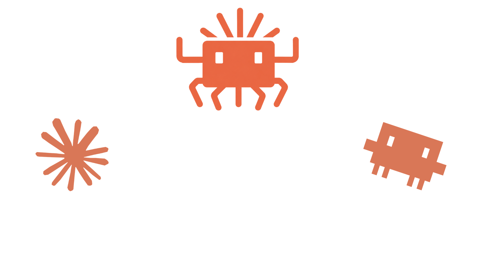
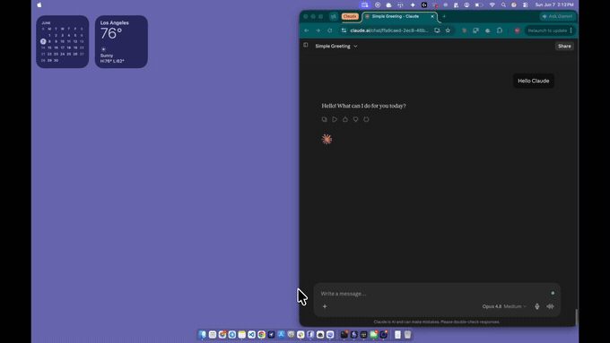

<p align="center">
  
</p>

<h2 align="center">Control every coding agent, on every computer, from one conversation.</h2>

<p align="center">
  <a href="https://github.com/Maxmedawar/tandem/actions/workflows/ci.yml"></a>
  <a href="https://github.com/Maxmedawar/tandem/releases"></a>
  <a href="LICENSE"></a>
  =22.6">
  <a href="https://github.com/Maxmedawar/tandem/stargazers"></a>
  
</p>

<p align="center">
  
</p>

Tandem turns an MCP-capable AI chat into a control desk for all of your coding agents.

Open your browser, desktop AI client, or another MCP agent and ask it to start Claude on your laptop, check Codex on your workstation, continue a task on your server, or stop a runaway terminal command. Your agents stay on the computers where their projects and tools already live. Tandem gives you one secure connection for reaching all of them.

```text
your browser chat / AI client / MCP agent
                       |
                    Tandem
              _________|_________
             |         |         |
          laptop   workstation  server
          Claude      Codex      Hermes
```

## What you can do

- See which computers are online and which agents they can run.
- See every live Tandem session across those computers.
- Start Claude Code, Codex, Hermes, or a terminal shell on the computer that has the project.
- Send more work to a running agent without restarting it.
- Read new output, interrupt a stuck turn, or close a finished session.
- Move between your browser, desktop client, and other MCP-capable agents without losing the sessions running on your machines.
- Add multiple computers. Enrolled devices stay connected and reconnect automatically.

For example, from a browser client that supports remote MCP connectors:

> Show me every agent currently running.

> Start Codex on `studio` and have it review the authentication changes.

> Send the failing test output to Claude on `laptop` and ask it to fix the regression.

> Stop the shell command running on `server` but leave the session open.

Tandem is the bridge behind that conversation. It does not replace Claude, Codex, Hermes, or your preferred AI interface.

## Why use Tandem

Without Tandem, each agent is trapped inside the terminal and computer where it started. You switch machines, open SSH sessions, search for the right terminal, and repeat context by hand.

With Tandem, one agent can coordinate the others. You can begin work from a browser, let agents run on the machines that have the right repositories and tools, and come back later from a different client to inspect or steer them.

## Fastest setup: give this to your agent

Paste this into Claude Code, Codex, or another trusted local coding agent on the computer you want to use as the Tandem hub. It will perform the installation and pause only when it needs you to sign in, approve a Tailscale setting, or choose which folders it may use.

```text
Install Tandem on this computer for me from:
https://github.com/Maxmedawar/tandem

Tandem lets an MCP-capable browser chat or AI client see, start, steer, and stop
my coding agents across all of my enrolled computers.

Do the setup yourself. Keep explanations short. Stop only when you need me to
sign in, approve an account setting, or answer a required question.

Safety rules:
- Read README.md, SETUP.md, SECURITY.md, and .env.example before changing anything.
- Preserve unrelated files and working-tree changes.
- Ask me which exact project folders Tandem may use. Never choose my home folder
  or a filesystem root. Do not continue until I answer.
- Ask which extra engines I want. Claude is the only default. Do not enable
  Codex, Hermes, shell, or Claude permission bypass unless I explicitly request it.
- Never print or paste a consent password, OAuth token, fleet credential,
  invitation token, private Tailscale address, or tailnet identity. You may report
  only the protected local file paths that setup intentionally prints, without
  reading or copying those files' contents.
- Never put a secret in a URL, command argument, issue, screenshot, or log.
- Use Tailscale Funnel only for the public MCP service. Use the separate,
  tailnet-only Tailscale Serve service for device traffic.
- Stop if a verification fails. Do not report partial setup as success.

Steps:
1. Check for Node.js 22.6+, tmux, Tailscale, and at least one supported coding
   agent. Install missing prerequisites with the normal package manager when safe.
   If an install needs administrator approval, ask me first.
2. Check whether Tailscale is running and connected. If I must sign in or enable
   HTTPS or Funnel in my account, give me short numbered instructions and wait.
3. Clone the repository if it is not already present, then enter the repository.
4. After I provide the allowed project folders and optional engines, run:
   TANDEM_CWD_ALLOWLIST=<exact approved folders> ./setup.sh hub
5. Confirm that setup verified public OAuth, rejected an unauthenticated private
   device connection, and detected the hub as a local device.
6. Confirm protected Tandem state is outside the repository and owner-only.
   Check permissions without displaying any secret contents.
7. Run npm run typecheck, npm test, and npm audit.

When everything passes, tell me only:
- that Tandem is ready;
- the stable MCP URL reported by setup;
- where setup stored the consent password, without reading it;
- where setup stored the first device invitation, without reading it;
- that I can run ./setup.sh invite once for each additional computer;
- that an invitation expires after 15 minutes if unused, but an enrolled device
  stays connected and reconnects automatically.
```

The same installation prompt lives in [SETUP-PROMPT.md](SETUP-PROMPT.md).

## Supported agents

| Engine | What Tandem controls | Default |
|---|---|---:|
| Claude Code | A real interactive Claude Code session | On |
| Codex | A real interactive Codex session | Off until enabled |
| Hermes | An explicitly approved Hermes agent | Off until enabled |
| Shell | A terminal running as your OS user | Off until enabled |

Claude is enabled by default. Enable only the additional engines you intend to expose:

```bash
TANDEM_ENABLED_ENGINES=codex,hermes ./setup.sh hub
```

Shell access is powerful. It gives an approved caller command execution as the Tandem OS user and is not a sandbox.

## Set up the main computer

You need:

- Node.js 22.6 or newer
- tmux
- Tailscale, connected with `tailscale up`
- at least one supported agent installed

Clone Tandem and tell it which project folders it may use:

```bash
git clone https://github.com/Maxmedawar/tandem.git
cd tandem
TANDEM_CWD_ALLOWLIST=/absolute/path/to/project ./setup.sh hub
```

Setup gives you:

1. One stable MCP URL to add to a compatible browser or desktop AI client.
2. A local owner password used once when approving that connection.
3. A protected invitation file for adding the first remote computer.

The MCP URL contains no secret. Your client opens Tandem's OAuth approval page when it connects.

## Add more computers

Create a separate invitation for each computer you want to add:

```bash
./setup.sh invite
```

Copy the reported invitation file to that computer, clone Tandem there, and run:

```bash
git clone https://github.com/Maxmedawar/tandem.git
cd tandem
TANDEM_CWD_ALLOWLIST=/absolute/path/to/project \
TANDEM_DEVICE_ID=studio \
TANDEM_DEVICE_NAME=studio \
./setup.sh device /secure/path/device-enrollment.json
```

Repeat this for every computer. Multiple invitations may exist at the same time.

The 15-minute limit applies only to an unused invitation file. It does not limit the device. After enrollment, the device stays authorized and reconnects automatically until you rotate its fleet credential or remove its protected configuration.

## Connect a local desktop client

If the AI client runs on the same computer and you do not want any network listener:

```bash
TANDEM_CWD_ALLOWLIST=/absolute/path/to/project ./setup.sh desktop
```

This writes a local MCP connector under `~/.tandem/desktop/connector.json`. The client starts Tandem directly over stdio.

## What your connected AI can call

| Tool | What it lets the AI do |
|---|---|
| `list_devices` | See your connected computers and their available engines. |
| `list_sessions` | See live Tandem sessions on a computer. |
| `open_session` | Start or reattach to an agent session. |
| `send_to_session` | Give the agent more work or read its latest output. |
| `interrupt_session` | Stop the current turn while keeping the session alive. |
| `close_session` | End a Tandem-owned session. |
| `relay` | Run Tandem's optional persistent Claude lead-and-worker loop. |

Tandem routes remote sessions using stable names such as `studio:review`, so later requests return to the same agent on the same computer.

## Security in plain language

Tandem controls real coding agents and terminals, so treat access to it like remote terminal access.

- You choose the folders where Tandem may start sessions. An empty list denies all new sessions.
- Tandem only reconnects to sessions it created and owns.
- Claude permission bypass is off unless you explicitly enable it.
- Codex, Hermes, and shell are off unless you explicitly enable them.
- Public MCP access requires OAuth approval.
- Device traffic stays inside your Tailscale network.
- A device invitation works once and expires if unused. The enrolled device itself does not expire.
- Default logs exclude prompts, terminal output, project paths, credentials, hostnames, usernames, IP addresses, and Tailscale identity.

The folder allowlist controls where a session starts. It is not an operating-system sandbox. Every agent still has the permissions of the OS account running Tandem.

Read [SETUP.md](SETUP.md) for operations and troubleshooting. Read [SECURITY.md](SECURITY.md) before exposing a hub.

## Browser and client compatibility

Tandem works with clients that support remote MCP servers and OAuth. When that capability is available in a browser-based AI product, you can control Tandem directly from that browser conversation. Tandem also works with local MCP clients over stdio.

Tandem provides the agent-control backend. It cannot add MCP support to a third-party interface that does not offer it, and it cannot force a third-party chat to resume on its own.

## Development

```bash
npm install
npm run typecheck
npm test
npm audit
```

The automated setup tests use temporary homes, synthetic network names, loopback listeners, and a mocked Tailscale CLI. They do not change your real Tailscale configuration.

## License

MIT. See [LICENSE](LICENSE).
